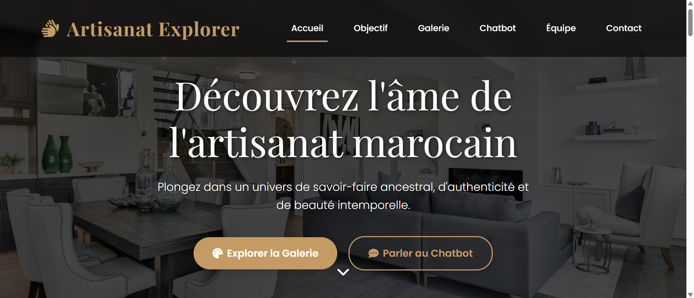
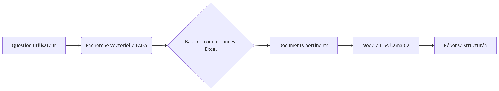

# Artisanat Explorer - Plateforme de Découverte de l'Artisanat Marocain



## 🌟 Présentation

Artisanat Explorer est une plateforme web immersive qui célèbre le riche patrimoine artisanal marocain. Ce projet combine une galerie visuelle élégante avec un assistant IA intelligent pour offrir une expérience interactive dans l'univers des métiers traditionnels marocains.

## ✨ Fonctionnalités principales

- **Galerie visuelle** présentant quatre domaines clés :
  - 🪴 Poterie traditionnelle
  - 🍶 Céramique artistique
  - 🎨 Peinture artisanale
  - ✒️ Calligraphie islamique
- **Chatbot intelligent** avec système RAG (Retrieval-Augmented Generation)
- **Design responsive** adapté à tous les appareils
- **Navigation fluide** avec effets de défilement
- **Interface intuitive** avec mise en évidence des liens actifs

## 🛠️ Structure du projet

```
ARTISANAT-EXPLORER/
├── static/
│   ├── css/
│   │   └── style.css            # Styles principaux
│   ├── images/                  # Bibliothèque visuelle
│   │   ├── Calligraphie.png
│   │   ├── Céramique.png
│   │   ├── mission.png
│   │   ├── Peinture.png
│   │   └── Poterie.png
│   └── js/
│       └── script.js            # Logique interactive
├── templates/
│   └── index.html               # Page principale
├── venv/                        # Environnement virtuel
├── app.py                       # Backend Flask
├── Peinture_et_Calligraphie.xlsx # Base de connaissances
├── Poterie_et_Céramique.xlsx    # Base de connaissances
├── README.md                    # Documentation
└── requirements.txt             # Dépendances
```

## ⚙️ Technologies utilisées

### Frontend
- **HTML5/CSS3** - Structure et style
- **Bootstrap 5** - Framework responsive
- **JavaScript** - Interactivité
- **Font Awesome** - Icônes
- **Animate.css** - Animations fluides

### Backend
- **Flask** - Micro-framework Python
- **Ollama** - Modèles LLM locaux
- **LangChain** - Chaînes de traitement IA
- **FAISS** - Recherche vectorielle
- **Pandas** - Traitement des données Excel

## 🚀 Installation et exécution

### Prérequis
- Python 3.8+
- [Ollama](https://ollama.com/) installé localement
- Modèles Ollama : `mxbai-embed-large` et `llama3.2:latest`

```bash
# Cloner le dépôt
git clone https://github.com/Maha-Jr10/artisanat-explorer.git

# Créer l'environnement virtuel
python -m venv venv

# Activer l'environnement
# Windows:
venv\Scripts\activate
# Linux/Mac:
source venv/bin/activate

# Installer les dépendances
pip install -r requirements.txt

# Démarrer Ollama (dans un terminal séparé)
ollama serve

# Télécharger les modèles IA
ollama pull mxbai-embed-large
ollama pull llama3.2:latest

# Lancer l'application
python app.py
```

Accédez à l'application : `http://localhost:5000`

## 🤖 Système RAG (Retrieval-Augmented Generation)

Le chatbot utilise une architecture innovante :





1. **Embedding** : Transformation des données en vecteurs avec `mxbai-embed-large`
2. **Recherche** : Identification des informations pertinentes via FAISS
3. **Génération** : Création de réponses avec `llama3.2`
4. **Formatage** : Production de réponses en Markdown structuré

## 🧠 Fonctionnalités clés du code

### `app.py` (Backend Flask)
- Initialise le système RAG avec les données Excel
- Fournit une API pour le chatbot
- Gère les requêtes et renvoie les réponses générées

### `script.js` (Frontend JavaScript)
- Gère les interactions du chatbot
- Affiche les messages de l'utilisateur et du bot
- Anime l'indicateur de saisie
- Met à jour dynamiquement la navigation

### `style.css` (Styles CSS)
- Palette de couleurs inspirée de l'artisanat marocain
- Design responsive pour tous les appareils
- Animations et transitions fluides

## 👥 Équipe

Étudiants en Ingénierie des Sciences de Données et IA à l'ENSA Fès :

| Membre             | Contact |
|--------------------|---------|
| **John Muhammed**  | [LinkedIn](https://www.linkedin.com/in/Maha-Jr/) \| [GitHub](https://github.com/Maha-Jr10) |
| **Ibnyassine Aya** | [LinkedIn](https://www.linkedin.com/in/aya-ibnyassine-80b017292) \| [GitHub](https://github.com/Aya-Ibnyassine) |
| **Berrahioui Hajar** | |

## 📄 Licence


Ce projet est sous licence [MIT](LICENSE).
